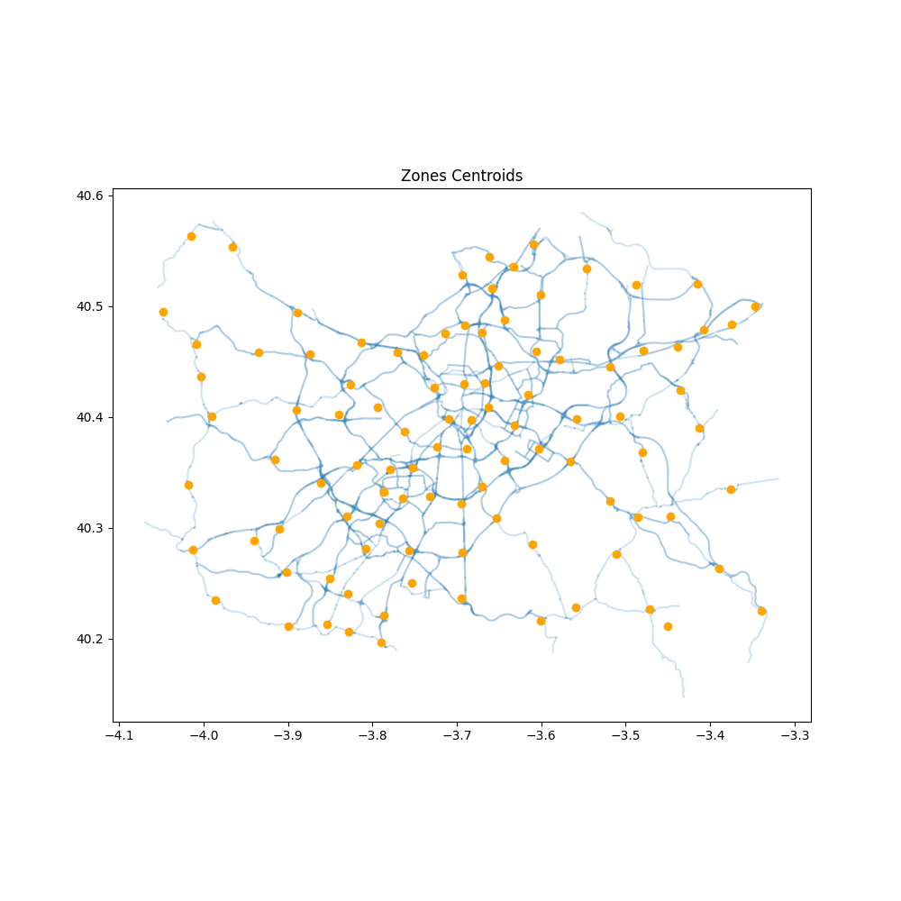
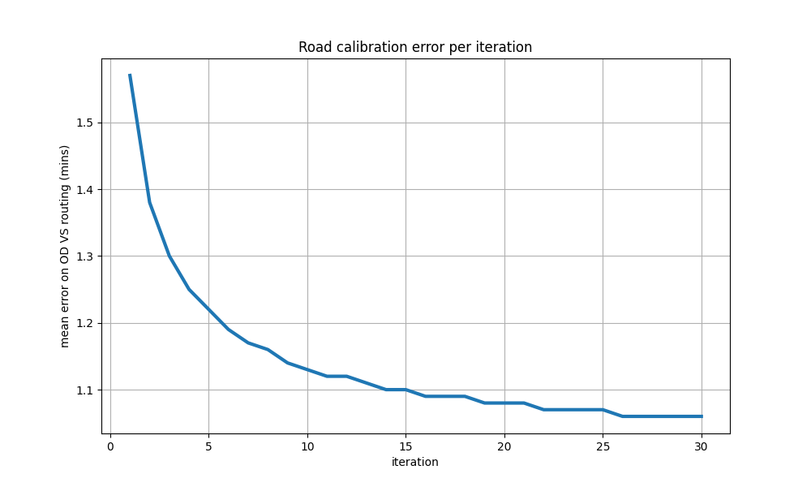
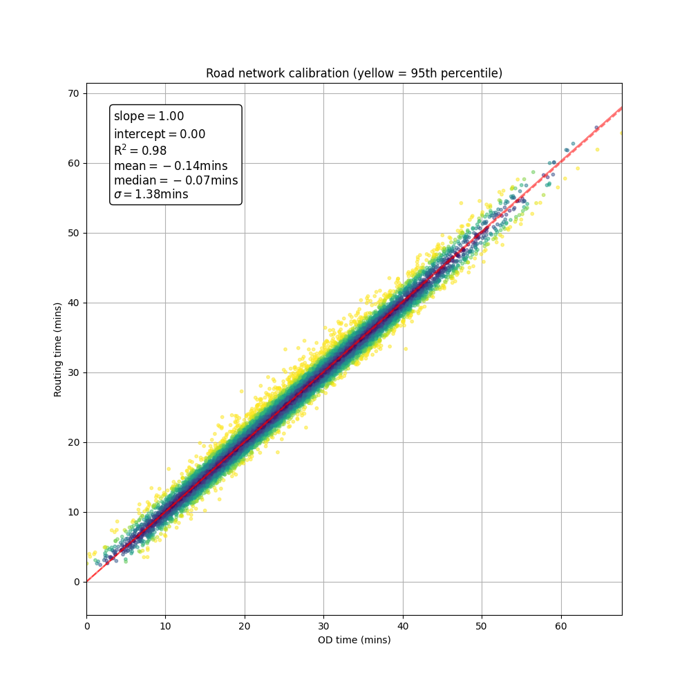
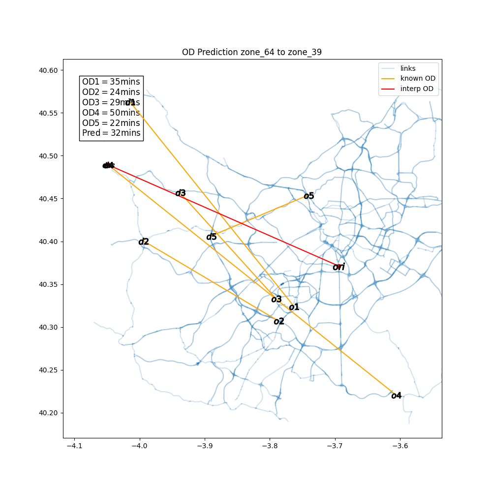
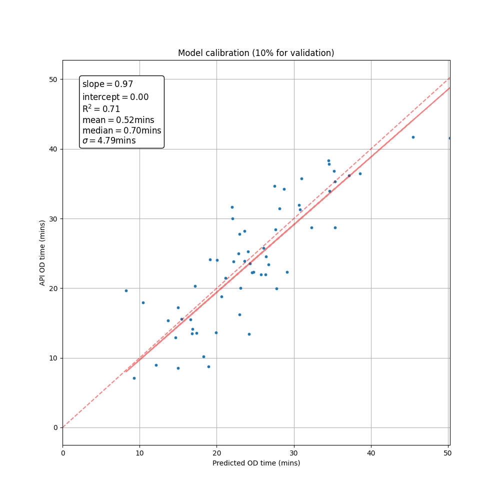
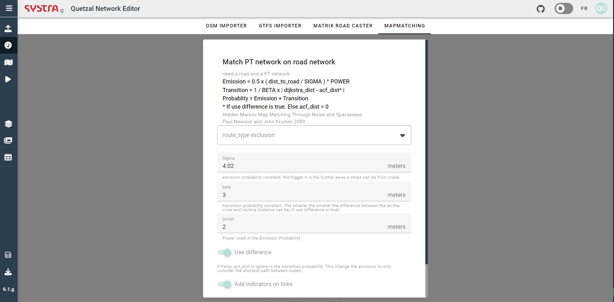
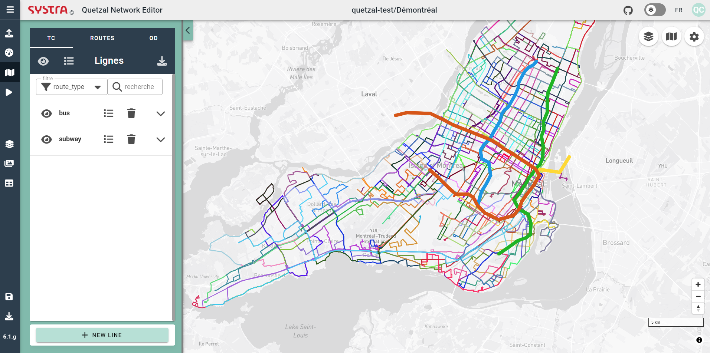

# Access and manage you projects in the browser
Quetzal Cloud provides a graphical interface to manage your projects stored in the cloud.
* Access all your project in the same place. 
* Find, your scenarios easily with the search bar. 
* Manage the inputs and outputs of your scenarios.
* Both cloud storage and zip files upload and downloads are supported

# Microeservices
The micro services provide robust automated processing to make the best of the road and public transport network data.
## OpenStreetMap importer (OSM importer)
Import a road network from Open Street Map, clean it and convert it to Quetzal's light road network format.
* draw a polygon on the map
* choose the types of roads you want to import, only the main one or the detailed network
* include cycleway details if needed

## GTFS Importer
Import GTFS data either from a zip file or download it from an online repo and convert it to Quetzal's own public transport format.
* upload a zip file with the zip importer or 
* from database.mobilitydata.org

## Matrix Road Caster

Matrix Road Caster is a machine learning algorithm used to estimate the average speed on the road links at a given time of the day.

Random origins and destinations are scattered on the network, the Origin-Destination times are requested on the Here API for the chosen time of day

The iterative algorithm adjusts the speed on the network and computes the shortest path until the OD times are consistent between the network and the request pool.
  
 
To calibrate the roads at a small scale with few requests, OD times are interpolated before the iterative OD to road time algorithm.
 
The relevancy of the interpolation is monitored

## Mapmatching

Most of the bus routes use the road network. To each station to station segment correspond a list of roads. Understand which roads are used by with bus is crutial to be able to map the load of the buses on the road and to apply the congestion delays to the buses. The mapmatching microservices uses and advanced algorithm to merge the road and public transport network.

# Network Editor
## Public Transport Network
The public transport map shows all the public transport routes.
* the trips can be sorted, filtered and edited in groups with the lateral panel

The network editor offers features 

