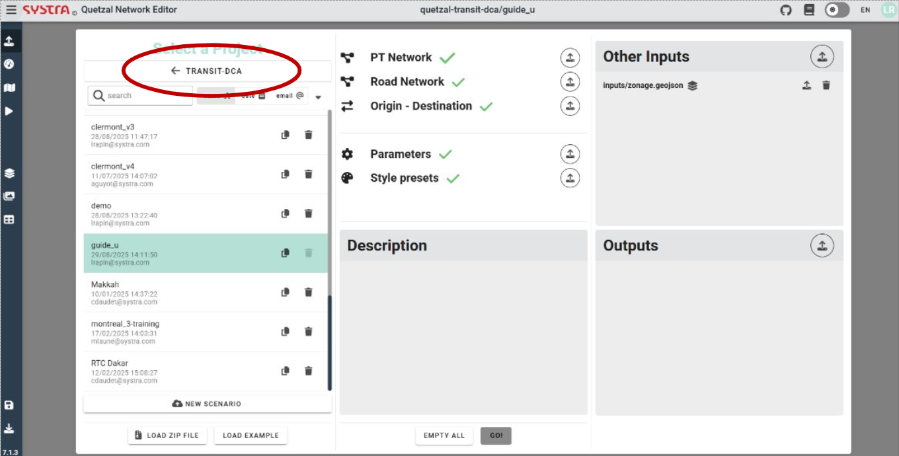

# Introduction

**Transit-DCA** is a model developped to compute basic indicators for transport networks (including network coverage, operating costs, necessary fleet size per line, vehicle.kilometers) providing easily accessible input data. It allows to get a first idea of a network's performances and offers ways to visualize results on a map, making quantitative data easily understandable.

To create or open a TRANSIT-DCA project, make sure the TRANSIT-DCA model is selected in the Input tab.

