# Public Transport Network

Public transport network can 
    * be drawn directly in the app under the Map tab (see section **Create a new line in the Public Transport Editor**)
    * imported using GTFS format via the GTFS importer micro-service (see section **Import lines through the GTFS importer micro-service**)
    * simply imported via a ZIP file of a pre-existing road network under the Import tab

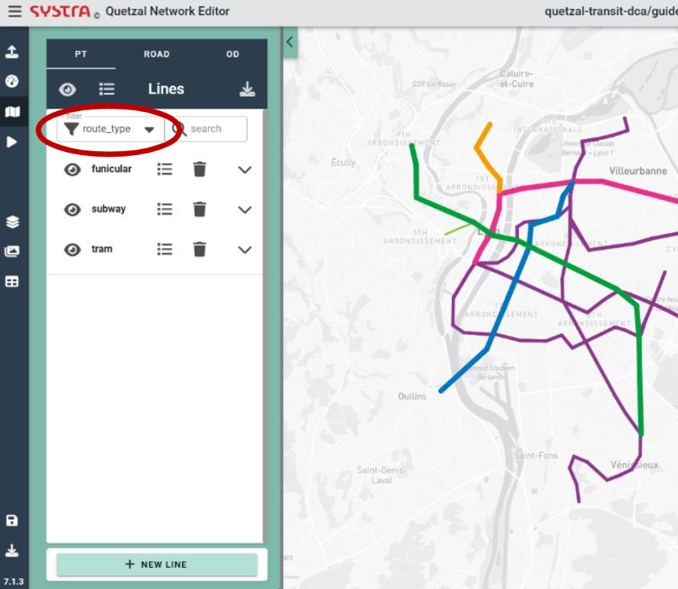

## Create a new line in the Public Transport Editor

In order to add a new line, open the Map tab, click on the **NEW LINE** button. Then, fill in the properties of the new line. You may want to give it a name, a short name and a route type (such as bus or subway). Then, hit the **SAVE** button.

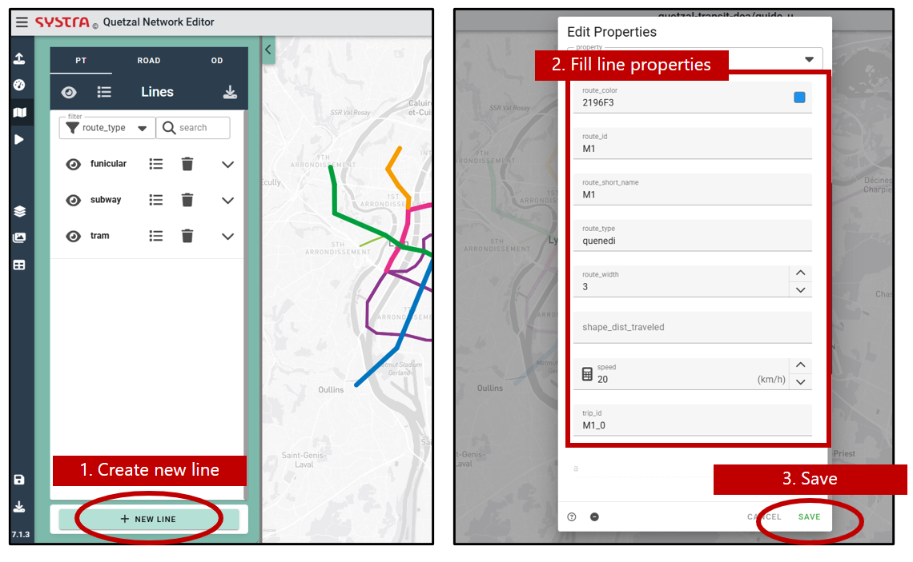

### Mandatory line properties

For calculations to run successfully, you must ensure the following line properties are filled as follows:

- **"route_id"**: id of the route, unique for each route. This is the name of the line as it will appear in the results
- **"direction_id"**: 1 or 0. This attribute should match the suffix of the **trip_id** attribute. This attribute adjusts automatically when creating return lines (see below).
- **"trip_id"**: id of the trip, one trip_id corresponds to one line and one direction along this line. Needs to be formatted as **route_id**_**direction_id** (e.g.: **"route_id"**=A, **"direction_id"**=0, **"trip_id"**=A_0)

- **"headway"**: service interval in seconds.
- **"route_short_name"**: alias of the line, easy to read.
- **"route_type"**: type of transport: bus, train, tram... 
- **"speed"**: commercial speed in km/h. This can be adjusted using road network speeds using. If a road network is used, public transport speed for lines using the road network will be adjusted.

### Optional line properties

To enrich the analyses, you can add additional properties of the lines. To do so, scroll all the way down through the list of line properties, enter the name of your new field in the **add field** section, then hit the "+" symbol on the right. 

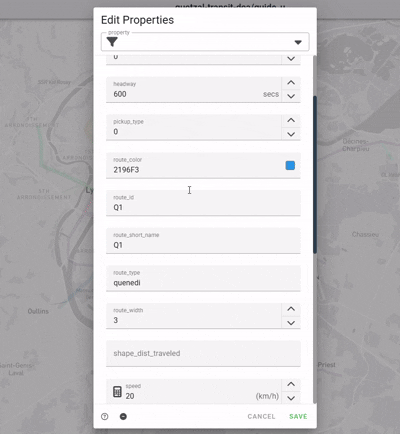

The properties you can add are the following:

* Catchment radius: for catchment to be computed, you also need to provide a zonage.geosjon file in the scenario's inputs (see section 03_load_project).
    * **"catchment_radius"**: distance to the network used to compute network/line/station coverage (in meters). You may introduce several catchment radii to assess coverage for different access modes (people reaching the transport network by walking, biking, driving...). To do so, create different properties and name them **"catchment_radius_mode1"**, **"catchment_radius_mode2"**... , where **mode1**, **mode2** should be replaced by the modes you wish to model (walk, bike, car...). Default value **"catchment_radius"**=500m will be used if no value is set.

* Service hours: 
    * **"nb_service_hours"**: Number of service hours. Default value **"nb_service_hours"**=12 will be used if no value is set.

* Peak hours parameters: if those fields are not added, no peak hour will be considered.
    * **"nb_peak_hours"**: Number of peak hours throughout a day. 
    * **"headway_ph"**: Interval of service during peak hour (in seconds)
    * **"headway_oph"**: Interval of service outside peak hour (in seconds)

::: tip 💡 TIP
Alternatively, after creating your line, you will be able to define its time schedule. See section **Create line time schedule** below.
:::

* Capacity:
    * **"capacity"**: Rolling stock capacity for the selected line. Default value **capacity**=60 will be used if no value is set.

* Operational costs:
    * **"opex"**: Operational costs in €/veh.km. Default value **opex**=0.3 will be used if no value is set.

* Travel time: Applicable only if a road network is used.
    * **"road_pt_factor"**: Used only if links follow road network for this line. Speed reduction factor for road public transport modes (bus, express bus, etc.). Default value **road_pt_factor**=1.25 will be used if no value is set.
    * **"stop_interval"**: Dwell time, time penalty (in seconds) that is added to the total travel time for each stop along the line. Default value **stop_interval**=300 will be used if no value is set.

* Modal share: Applicable only if a origin-destination matrix is used.

### Drawing a line

Once your line is initialized, click anywhere on the the map to start drawing. Stop drawing with a right click anywhere on the map. Once the line is complete, hit the **CONFIRM** button to save it, you can always edit the properties and the itinerary of your line later.

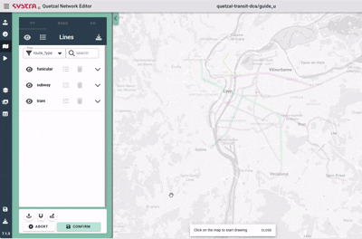

You can add a stop in the middle of a line with a left click on a link. You can also cut the line with a right click on a node > **CUT BEFORE NODE** or **CUT AFTER NODE**. 

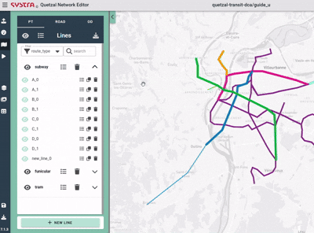

Once you have created a line for one direction, you can duplicate it and reverse it to create the return line. TO do so, click the **duplcate** icon in the list of lines and select **reverse**. Update the **New name** field to the desired trip_id of the new trip by matching the direction_id. If the trip you duplicated has its trip_id set to *A_0*, the trip_id of the return trip should be set to *A_1*.

For bus lines, you may have to adjust a litle bit the return line to avoid one way roads. To create bus stops on different sides of a road or create different routes for different directions, you must select the **duplicate nodes** option.

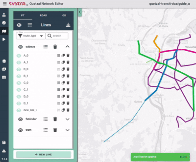

## Import lines through the GTFS importer micro-service

You can also use the GTFS importer micro-service to import public transport networks from GTFS files, from your computer or directly from the online open mobilitydata database. See documentation under the **Micro services / GTFS importer** section of this documentation.

To ensure the calculations are successfully carried out, you must add the desired properties (among those mentioned in the **Create a new line** section above) to the imported lines. To do so, see the **Edit line properties** below.

## Editing an existing line

### Select a Line

To edit the itinerary of a line, find it in the left pannel and click on its name (you can use the filters and the search function to find it). You can also use the search bar.

Alternatively, you can hover over the map and right-click on your line. If multiple lines are overlaid, a popup will open, allowing you to choose which line you want to edit.

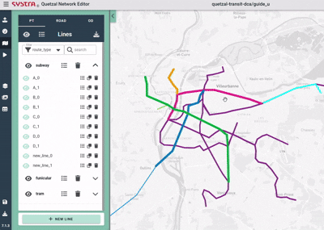

### Editor Options

By default, when creating or editing a line, the geometry is created «as the crow flies», straight links connect the stations. The following options are also available:

* Edit Line Geometry
* Stick Nodes on Existing Nodes
* Follow Roads

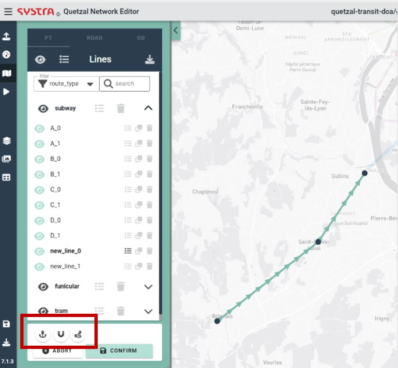
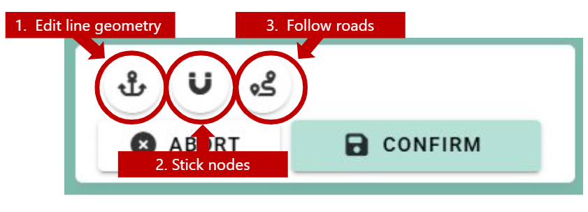

#### Edit Line Geometry

With this option, you can place «anchors» on your line in order to define more precisely the geometry : left click on the line to add an anchor point, drag them wherever you want, right click to delete one. This points are not stops, passengers cannot board nor alight there.

#### Stick Nodes on Existing Nodes

With this option, the other public transport stops are displayed. When you edit your line, you can move a node over an existing node of another line to re-use that node for your line. 

#### Follow Roads

With this option, the geometry of your line will follow the roads network (if provided; see section **05_road_network** for more information on how to download road network) between all the new stops you add.

You can also click on *ALL* or *NONE* to map all your line to the road network or revert to straight lines (none).

For lines using this option, speed will be recomputed during calculations using road network speed.

## Edit Links and Nodes Properties
While editing a line, you can right click on a link to edit its propoerties. You can also do the same on a node to edit its properties, for example to give names to nodes. 

## Edit Line Properties

If you click on **EDIT PROPERTIES** in the side panel, you will edit the properties of all the links of your line (or selected group). It is relevant for the headway, catchment radii, rolling stock capacity for instance or if you want to set a constant speed on all the line. 

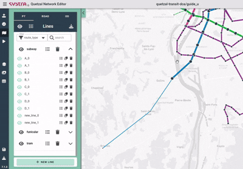

## Create or Edit a Schedule

By default, new lines are frequency-based, defined by the headway in the line properties. You can convert any line to be schedule-based by selecting **CREATE SCHEDULE** in the **EDIT PROPERTIES** form.

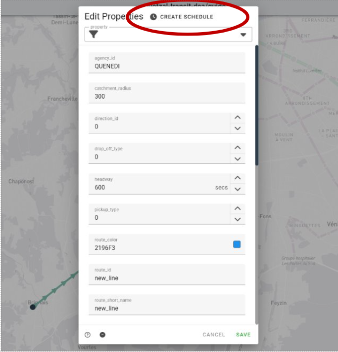

When creating a schedule, a single trip is generated with a starting time of **08:00:00**, travel times based on links *time*, and a default dwell time of 0 seconds. In the **departures** section on the right-hand side, you can see the departure times from each station of the line for the trip. In the **arrivals** section, you can see the arrival times. From the schedule editor, you can:

- Edit the schedule times (Departures and Arrivals) at each stops
- Select the station label for the schedule graph
- Create a new trip
- Delete a trip
- Select a trip to edit

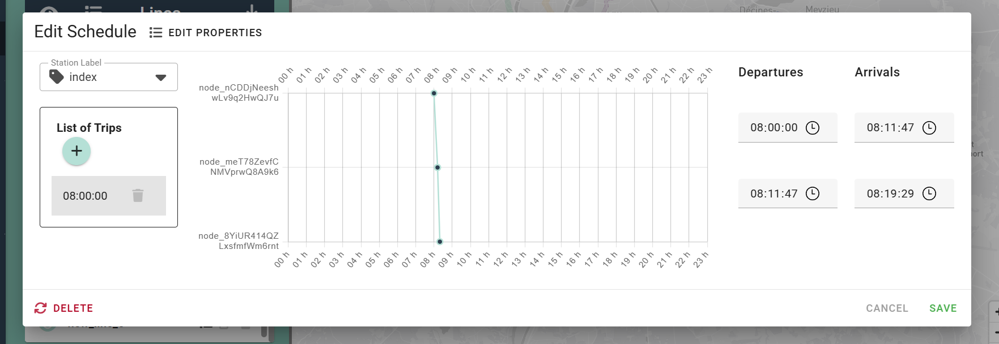

When creating a new trip, specify a start time. The travel times from the links and a default dwell time of 0 second will be used to compute the schedule.

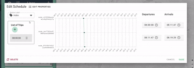