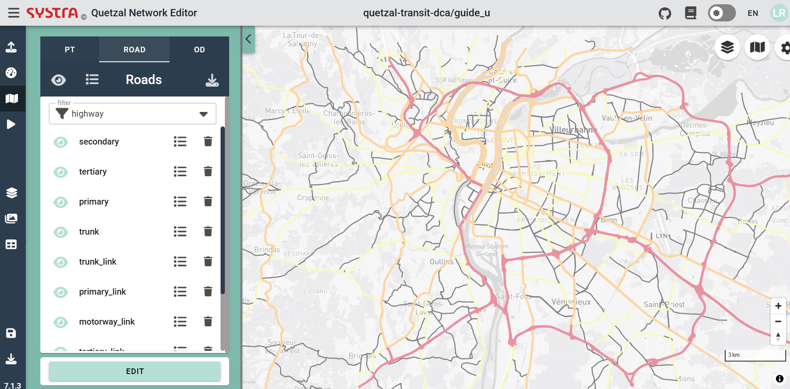
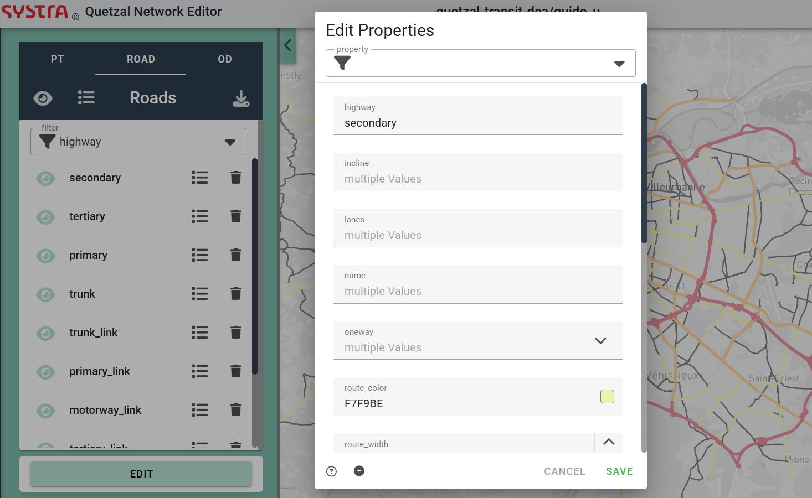

# Road network

Providing a road network is optional; however, including it can significantly enhance your analysis, especially if your model incorporates public transport modes that utilize the road network (bus, express bus).

## Importing road network

You can either import a road network directly from your computer (links and nodes in two distinct files links.geojson and nodes.geojson), or use the OSM importer micro-service to retrieve road network data from the OpenStreetMap database for a selected area. To do so:

1. Go to the Microservices tab
2. Open the OSM importer micro-srevice
2. Drag the map over the area to download
3. Select the types of links to download
4. Download

## Network editing

Under the Maps tab, you can:

- Modify road links individually by right clicking on the road link to edit
- Filter by anyway field desired and edit every link of a type 
- Select multiple road links by selecting an area on the map (right click) and edit selected info. You can also Ctrl+Click on links to add/remove them from the selection.

::: tip :cloud: TIP
You can create a group field in your road links that you can modify when you multiple select road links on the map. This will allow you to easily identify the links you edited group by group and later filter the links by group and edit them again.

:::

To select many several road links at the same time, hold shift and click on all the road links.

## Speed adjustment

The micro-service **Matrix road caster** allows you to adjust the road network speed. To do so:

1. Go to the Microservices tab
2. Open Matrix Road Caster micro-service
3. Chose the API to be used (provide a valid API key) and the zones to use. You can either use your own file by selecting **Use zone** (in that case you will need to upload the file in the **Other inputs** section of the import tab) or use auto-generated zones (you may specify the number of zones used).
4. Hit **Process**. Your speeds in your road network will be overwritten.

