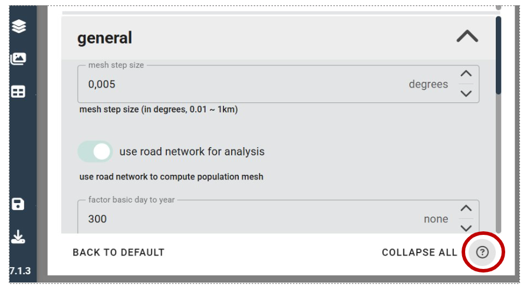
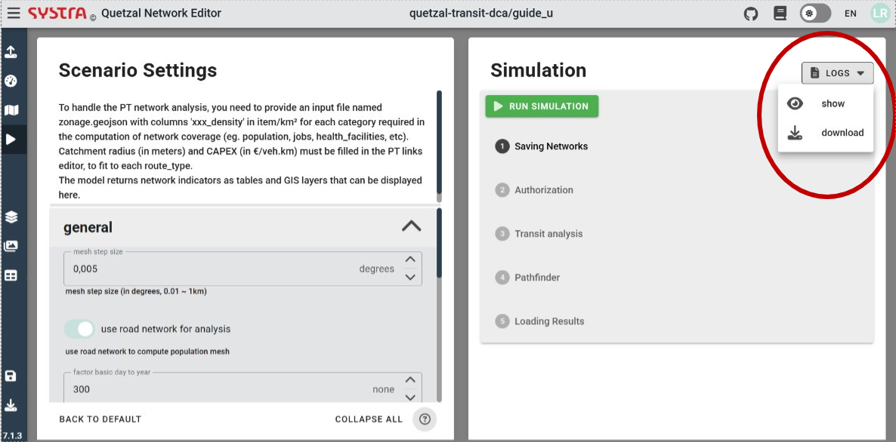

# Run a simulation
In the run tab, you can edit the parameters of a scenario and run a simulation

## Parameters
On the left pannel, you can set the parameters of the simulation and find information about them. If a description of the model has been provided, it will be displayed as a scrollable header. You can adjust the size of the header to read more or give more space to the parameters.

The parameters are grouped in categories, you can collapse and expand them to edit the parameters. Additional information can be added to each category.

::: tip :bulb: TIP
Click on the **(?)** icon to display or hide the hints provided for each parameter. You can edit the hints with a double click.
:::

## Run a simulation
Once the parameters are set, you can run a simulation with the **RUN SIMULATION** button. The interface will provide a update of the simulation process in real time. Once a step is succesfully completed, it turns green.

Once the simulation is complete, you can access the outputs in the dedicated tabs. You can also check the logs with the **LOGS** menue, it offers two options **SHOW** to read them directly in the interface and **DOWNLOAD**. The logs of each step are displayed in scrollable windows.

To see the available results, see section 6_results.