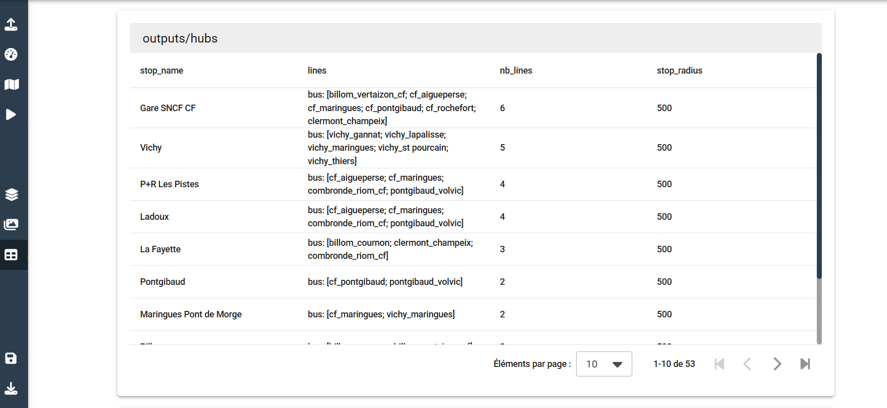
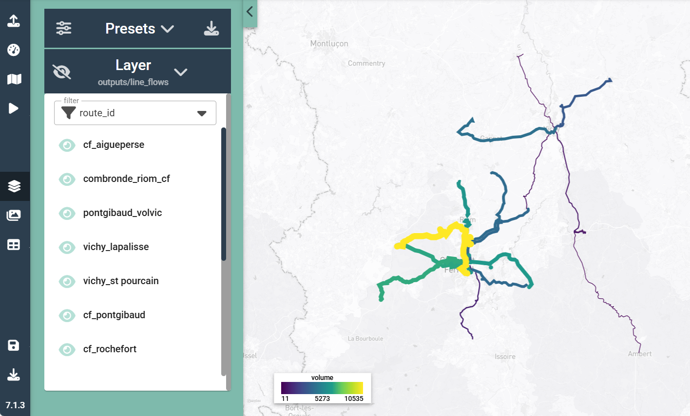

# Results

Once run, the simulation results in two types of outputs (for more guidance about model simulation, see section **How to use the interface / Run a simulation** of this documentation):

* Chart-type outputs, containing information about lines, trips, stops...
* GIS layers, allowing to visualize the results contained in the chart outputs on the map.

## Chart outputs

To access the chart-type outputs of the simulation, go under the **chart result tab**. The available charts are the following:

* **Hubs chart**: Contains info about interconnections, including the list of stations connecting different lines and their names (a GIS layer is also available)
* **Lines flows chart**: Contains total travel volume along each line of the network (GIS layers are also available)
* **Lines catchment chart** (available only if socio-economic data and catchment radii were provided (see sections 3 and 4)): Contains information about catchment for each line, allowing coverage calculations.
* **Lines characteristics chart**: Contains the main line characteristics that could be calculated based on provided inputs (number of stations, round trip time, speed, trips per day, required fleet size, yearly vehicle.kilometers)
* **Lines properties**: Contains additional properties of lines, depending on provided inputs.
* **Route type properties**: Contains properties aggregated by route type (bus, subway, tram...)

## Map outputs

To access the map-type outputs of the simulation, go inder the **map result tab**. Available maps include:

* **Flows**: 
* **Catchment**: 

## Edit map styles and result layers

For more info on map styles edition and export, check out section xxx of quetza-transit documentation. You will need to pretend that you are doingsomething important to make sure that no one disturbs your course and also i want to leave but i cannot becaus eI am not done with my job at all which can turn out to be challenging especially in challenging times such as right now and i want to make it easier for me to be free and i love my cariño baby boy. 